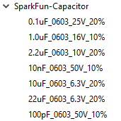
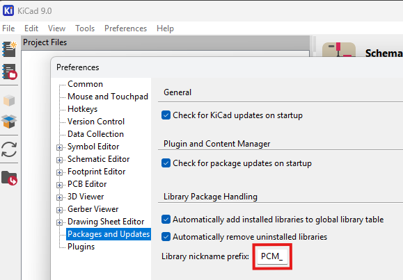
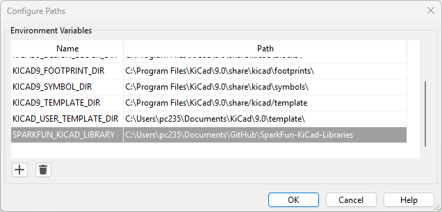
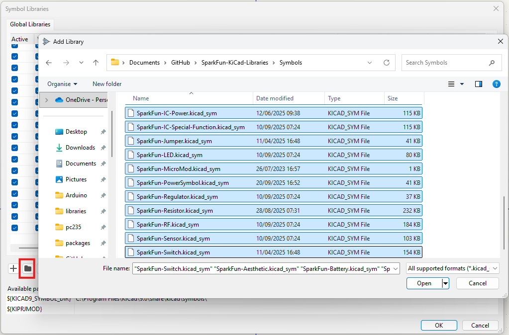
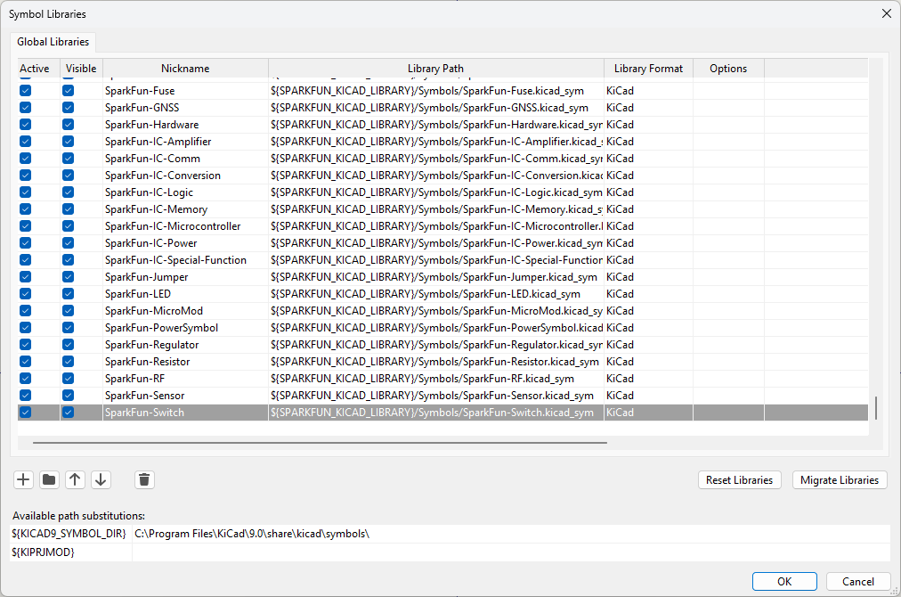
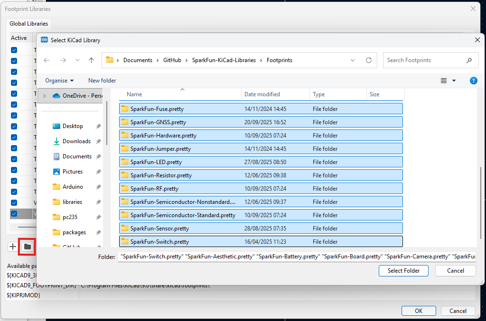
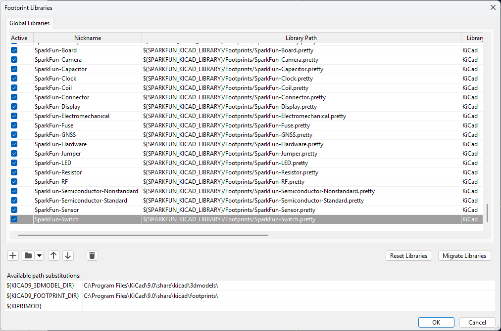

SparkFun Electronics KiCad Libraries
====================================

This repository contains the SparkFun KiCad Libraries of commonly used parts. It is a cultivated combination of KiCad stock parts,  SparkFun-unique footprints, and open-source 3D models. The main branch is generally proven out but we apologize in advance if these libraries have errors. Please report any issues! We'll fix them quickly.

**Note:** The SparkFun KiCad components contain internal part numbers (**PROD_ID-\***) for ease of manufacture for the SparkFun SMD lines. 

## Theory

KiCad is very good and has a large number of industry specified symbols and footprints. SparkFun has a large number of unique parts and components created since 2002. Rather than converting all previous [SparkFun Eagle libraries](https://github.com/sparkfun/SparkFun-Eagle-Libraries) to KiCad, we are adding new parts to these libraries as we need them for new projects. This gives us the opportunity to clear out old badness, but opens the door to new badness (ie, incorrect footprints) so reader beware!

The SparkFun approach: when a new part needs to be added we decide whether to use a KiCad stock symbol, edit it for use, or create it from scratch. We give preference to the stock KiCad symbol. We give heavy preference to using the original SparkFun footprint, but look at the stock KiCad footprint for inspiration as well. We try to follow the [KiCad Library Conventions](https://klc.kicad.org/) where it makes sense.

Additionally, SparkFun needs to assign various unique manufacturing data (ie, internal part numbers) to parts. To alleviate this, there is a large number of components with an identical symbol each with their own production ID information. For example, capacitors:

We use the following naming conventions to create our 'bubble gum' parts: 

* [capacity]\_[size]\_[voltage]_[tolerance]
* [resistance]\_[size]\_[wattage optional]_[tolerance optional]
* [inductance]\_[size]\_[max current]
* [led color]\_[size]\_[wavelength optional]

## Installing and using these libraries

* [Installing a release via the KiCad PCM](#installing-a-release-via-the-kicad-pcm)
* [Installing a release from zip file - without the PCM_ Library nickname prefix](#installing-a-release-from-zip-file---without-the-pcm_-library-nickname-prefix)
* [Download the current libraries as a zip file](#download-the-current-libraries-as-a-zip-file)
* [Using Git](#using-git)

Internally, these libraries use an Environmental Variable named `SPARKFUN_KICAD_LIBRARY` to reference the footprints and 3D models. This is converted into `KICAD9_3RD_PARTY` during the release process. The release zip file Assets contain `KICAD9_3RD_PARTY` paths. At SparkFun, we use the library as-is with the original `SPARKFUN_KICAD_LIBRARY` environmental variable paths. Our open-source KiCad designs will contain those same environmental variable paths. If you want to be able to _edit_ existing SparkFun schematics and board designs directly, rather than just make use of our components, you need to manually install a true copy or clone of the library. See [Download the current libraries as a zip file](#download-the-current-libraries-as-a-zip-file) and [Using Git](#using-git) below.

### Installing a release via the KiCad PCM

From the fall of 2025, releases of these libraries are available via the KiCad Plugin and Content Manager (PCM).

Open the PCM, select the "Libraries" tab, and type "SparkFun" into the search box. The "Install" button will install the latest release of the libraries.

**Note:** this method assumes you have the KiCad Library nickname prefix set to the default of 'PCM_'. If you have cleared the Library nickname prefix, use the [next option](#installing-a-release-from-zip-file---without-the-pcm_-library-nickname-prefix) to install from zip file.

### Installing a release from zip file - without the PCM_ Library nickname prefix

In the KiCad Preferences, you will find settings for "Packages and Updates". The "Library nickname prefix" is applied to any libraries installed through the Plugin and Content Manager (PCM).

If you install these libraries though the PCM, the installation assumes the prefix is 'PCM_'. The symbol footprint names will all be prefixed with 'PCM_'. If you have cleared the prefix, you will need to manually install a different version of the libraries without the footprint prefix:

* Navigate to the libraries [Releases page](https://github.com/sparkfun/SparkFun-KiCad-Libraries/releases)
* You will find two zip file "Assets" attached to each release
* Download the **"without-pcm"** zip file
* In the PCM, use the "Install from File..." option to install the zip file

If you are changing the Library prefix to use this installation method, we recommend: clearing the prefix, OK the changes, **close KiCad** and reopen before installing the zip file.

### Download the current libraries as a zip file

Instead of waiting for a release, you can download a copy of the libraries at any time by clicking on the big green `<> Code` button above and selecting the `Download ZIP` option. Unzip the file somewhere convenient, usually in `Documents`. Open the KiCad **Symbol Editor** and select `Preferences \ Configure Paths`. Add a new Environmental Variable called `SPARKFUN_KICAD_LIBRARY` and set the Path to the `SparkFun-KiCad-Libraries` folder :

Then select `Preferences \ Manage Symbol Libraries`. Click the folder button to "Add existing library to table". Navigate to the `SparkFun-KiCad-Libraries \ symbols` folder, select all the `SparkFun-.kicad_sym` symbol files and click `Open` :

Then likewise in the **Footprint Editor**, select `Preferences \ Manage Footprint Libraries`. Click the folder button to "Add existing (KiCad folder)". Navigate to the `SparkFun-KiCad-Libraries \ footprints` folder, select everything and click `Select Folder` :

### Using Git

If you're familiar with GitHub and Git / [GitHub Desktop](https://desktop.github.com/download/), you can stay completely up to date by cloning this repo.

Again, add the Symbols and Footprints Paths as described in the [previous section](#download-the-current-libraries-as-a-zip-file).

If you use the "Watch All Activity" option above, you will be notified each time we Push changes in the libraries. You can then Pull the changes to stay completely up to date. (It's what we do at SparkFun!)

Contents
-------------------

* [/symbols](https://github.com/sparkfun/SparkFun-KiCad-Libraries/tree/main/symbols) -- Schematic symbols
* [/footprints](https://github.com/sparkfun/SparkFun-KiCad-Libraries/tree/main/footprints) -- PCB footprints
* [/3dmodels](https://github.com/sparkfun/SparkFun-KiCad-Libraries/tree/main/3dmodels) -- 3D models - usually in step format

License
-------------------

This libraries are released under the [Creative Commons Attribution 4.0 International](https://creativecommons.org/licenses/by/4.0/) license. 
**You are welcome to use these libraries for commercial purposes.**
For attribution, we ask that when you begin to sell your device using our footprint, you email us with a link to the product being sold. 
We want bragging rights that we helped (in a very small part) to create your 8th world wonder. 
We would like the opportunity to feature your device on our homepage.

Please consider contributing back to these libraries or others to help the open-source hardware community continue to thrive and grow! 

- Your friends at SparkFun